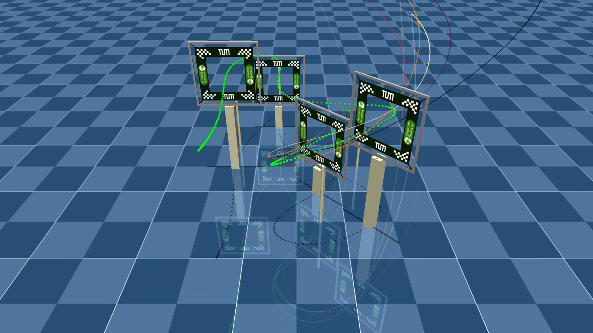
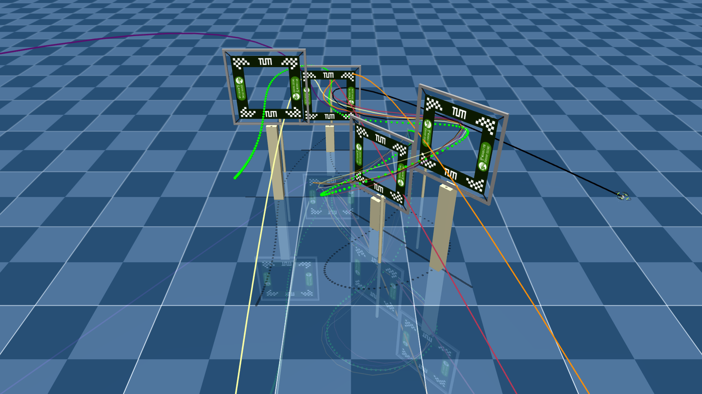
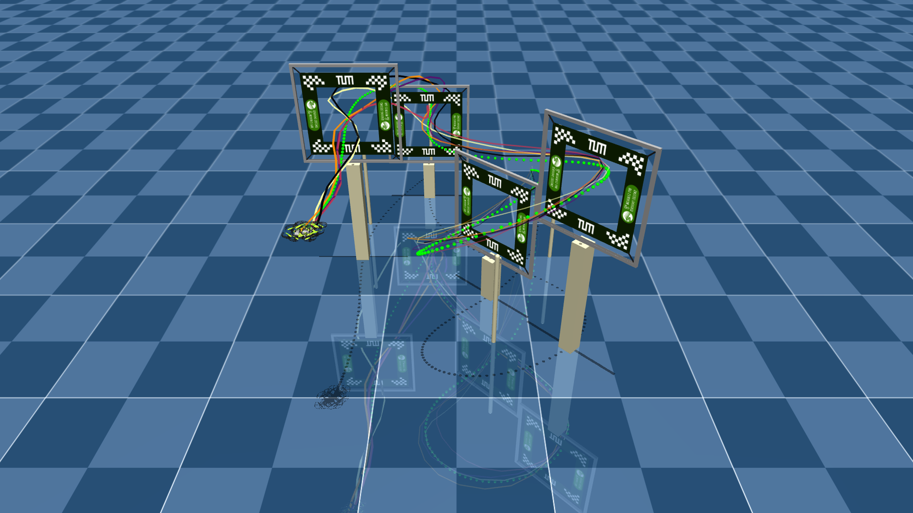

# crazyplan

Research demo highlighting the differentiable `crazyflow` simulator for Crazyflie drones. It optimizes an open-loop policy to fly a racing track, then exports and visualizes the resulting trajectory.

## Setup

Requirements: Python 3.11+, `uv` (recommended), and the `crazyflow` dependency (included in this repo).

Checkoout the repo and initialize the submodules
```bash
 git submodule update --init --recursive
 ```
Install uv and the projct in editable mode:
```bash
uv sync
uv pip install -e .
```

## CLI

All entrypoints live under `crazyplan/cli/`. Run them in module mode so imports resolve cleanly.

- Optimize a trajectory (reads `configs/train/default.toml` by default):
  ```bash
  uv run python -m crazyplan.cli.train --train-config configs/train/default.toml --plot --render
  ```
  Outputs checkpoints to the path in the train config (`train.policy_output` / `train.checkpoint_dir`), optional plots/renders.

- Export a trajectory from a trained checkpoint (uses `train.policy_output` by default):
  ```bash
  uv run python -m crazyplan.cli.export --train-config configs/train/default.toml --visualize none
  # or pick a specific checkpoint
  uv run python -m crazyplan.cli.export --train-config configs/train/default.toml --checkpoint outputs/checkpoints_window/trained_policy_step_000100.eqx
  ```
  Writes YAML/CSV under `outputs/export` (default), with optional plot/render (`--visualize plot|render|both`).

- Plot track geometry:
  ```bash
  uv run python -m crazyplan.cli.plot_track --track-config configs/tracks/drone_racing.toml
  ```

## Configs

Train configs live in `configs/train/*.toml`. Track configs live in `configs/tracks/*.toml`.

## Gallery




